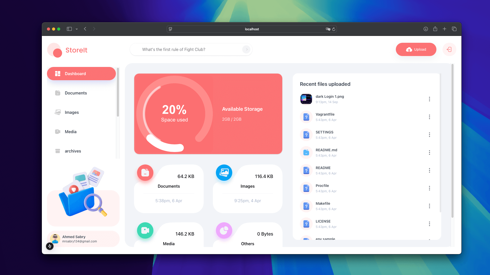
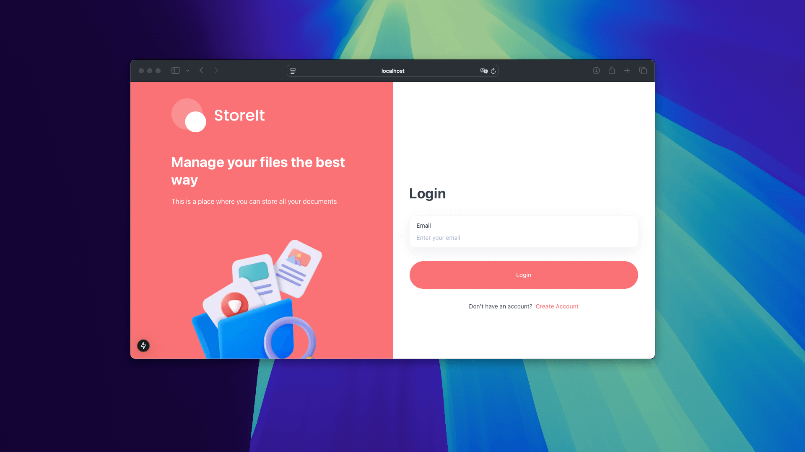
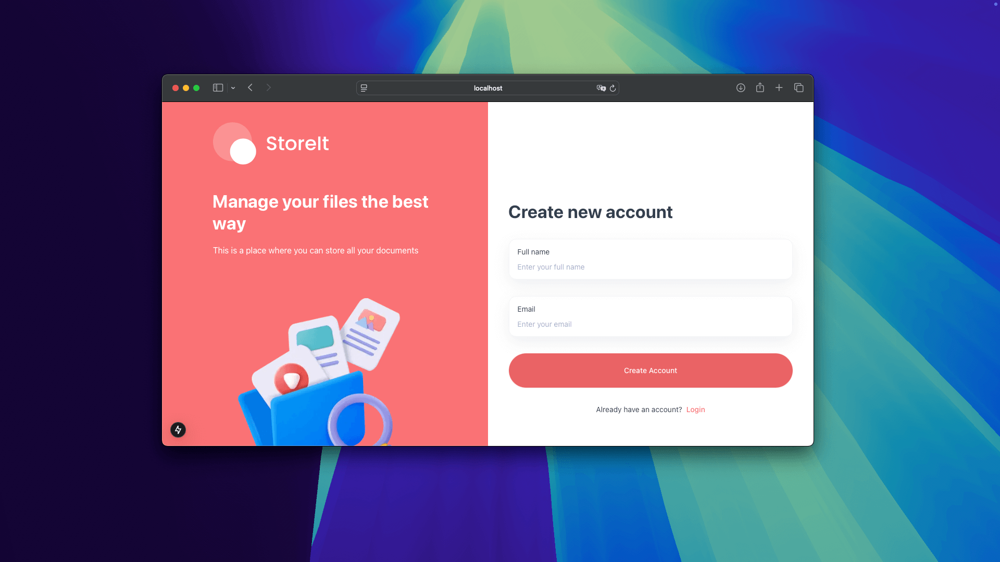
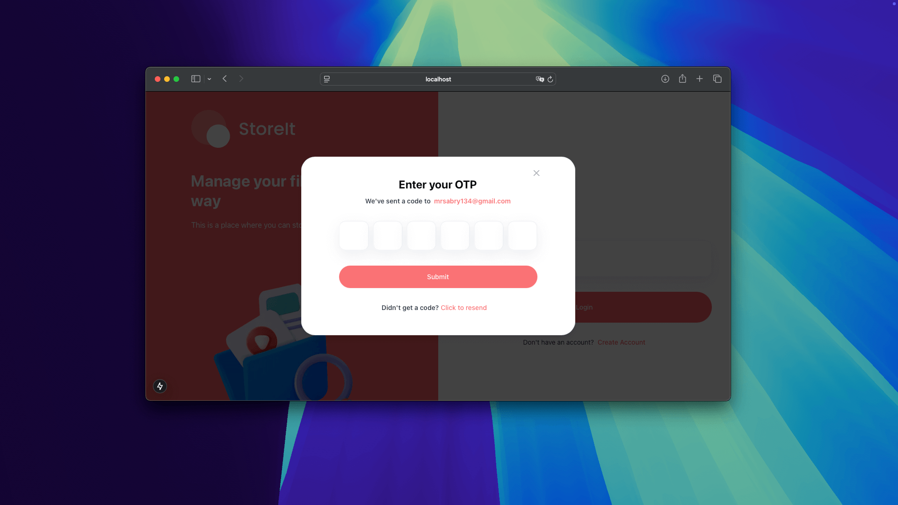
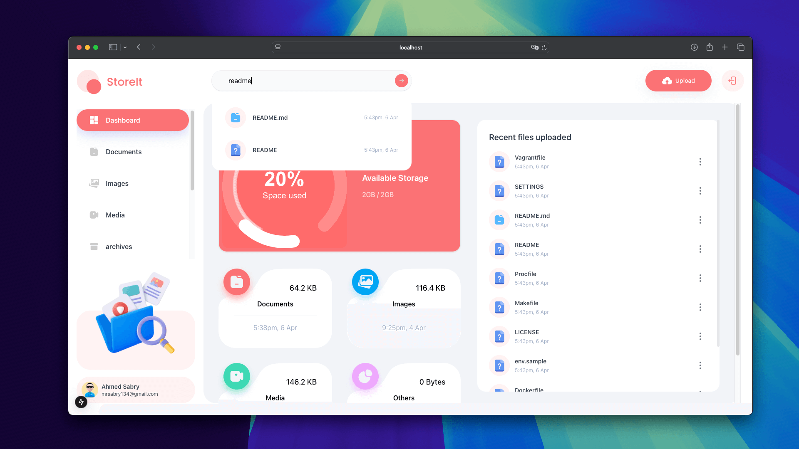
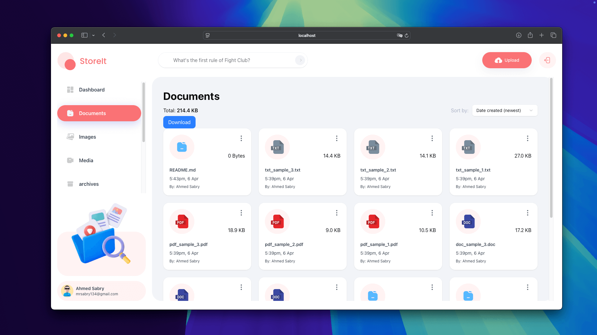

# File Manager App



## Overview

File Manager App is a modern, cloud-powered file management platform built with Next.js, React, TailwindCSS, and Appwrite. It provides a seamless experience for uploading, organizing, sharing, and searching files with advanced UI and robust security.

---

## Features

- 🚀 **Fast & Secure File Uploads**
- 🔍 **Advanced Search & Filtering**
- 📊 **Dashboard Analytics & Usage Stats**
- 📁 **Multi-format File Previews**
- 👥 **User Authentication (OTP, Email)**
- 🔗 **File Sharing & Permissions**
- 🎨 **Stunning UI with Radix & Lucide Icons**
- 🌗 **Dark/Light Theme Support**

---

## Screenshots

| Dashboard | Login | Signup | OTP Verification | Search | Category |
|-----------|-------|--------|------------------|--------|----------|
|  |  |  |  |  |  |

---

## Tech Stack

- **Next.js**
- **React 19**
- **TailwindCSS 4**
- **Appwrite** (Cloud backend)
- **Radix UI**
- **Lucide Icons**
- **Zod** (Validation)
- **Recharts** (Analytics)

---

## Getting Started

1. **Clone the repo:**
	```bash
	git clone https://github.com/ahmedsabry/file-manager-app.git
	cd file-manager-app
	```
2. **Install dependencies:**
	```bash
	pnpm install
	```
3. **Configure environment:**
	- Copy `.env.example` to `.env.local` and fill in your Appwrite credentials.
4. **Run locally:**
	```bash
	pnpm dev
	```

---

## Project Structure

```
src/
  app/         # Next.js app routes & layouts
  components/  # UI and functional components
  lib/         # Appwrite, utils, actions
  constants/   # Static config and mappings
  config/      # Appwrite/other config
  middleware/  # Error handling
public/
  assets/      # Icons, images
```

---

## Author

**Ahmed Sabry**  
Email: [mrsabry134@gmail.com](mailto:mrsabry134@gmail.com)

---

## License

This project is licensed under the MIT License.
